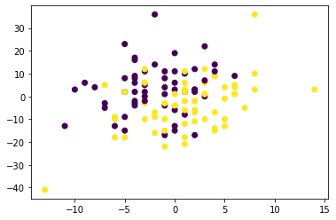

```{r setup, include=FALSE}
library(knitr)
knitr::opts_chunk$set(echo = TRUE,tidy=TRUE,message=FALSE,warning=FALSE,strip.white=TRUE,prompt=FALSE,
                      cache=TRUE, size="scriptsize",fig.width=6, fig.height=5)
```

```{r rpackages,eval=TRUE,echo=FALSE}
#install.packages("rmarkdown") #probably already installed
#install.packages("ggplot2") #plotting with ggplot
#install.packages("ggfortify")
#install.packages("MASS")
#install.packages("dplyr")
#install.packages("magrittr")
#install.packages("tidyverse")
#install.packages("caret")
library(magrittr)
library(knitr)
library(rmarkdown)
library(ggplot2)
library(ggfortify)
library(MASS)
library(dplyr)
library(randomForest)
library(tidyverse)
library(caret)
```

\clearpage

# Classification

## Overall

Classification algorithms have categorical responses. In classification we build a function f(X) that takes a vector of input variables X and predicts its class membership, such that Y in C.

## Possibilities of models

There are classifiers as logistic regression, Decision tree, Perceptron / Neural networks, K-nearest-neighbors, linear and quadratic logistic regression, Bayes  ...

## Some indicators

### Sensitivity and recall

The sensitivity (also named recall) is the percentage of true defaulters that are identified (True positive tests).
For example, probability of predicting disease given true state is disease.

$$sensitivity = recall = \frac{TruePositiveTests}{PositivePopulation}$$

### Specificity

The specificity  is the percentage of non-defaulters that are correctly identified (True negative tests).
1 - specificity is the Type 1 error, it is the false positive rate.
For example, probability of predicting non-disease given true state is non- disease.

$$specificity = \frac{TrueNegativeTests}{NegativePopulation}$$

### Precision

The precision is the proportion of true positive tests among the positive tests.
$$precision = \frac{TruePositiveTests}{PositiveTests}$$

### F-Mesure

The traditional F measure is calculated as follows:

$$F_Measure = \frac{(2 * Precision * Recall)}{ (Precision + Recall)}$$

### Rand index

The rand index is a mesure of similarity between two partitions from a single set.

Given two partitions $\pi_1$ and $\pi_2$ in E :
\begin{itemize}
\item a, the number of elements in $\pi_1$ and $\pi_2$
\item b, the number of elements in $\pi_1$ and not in $\pi_2$
\item c, the number of elements in $\pi_2$ and not in $\pi_1$
\item d, the number of elements not in both $\pi_1$ and $\pi_2$
\end{itemize}

\begin{center}
\begin{tabular} { | c | c | c |}
\hline
  & in $\pi_2$ & not in $\pi_2$ \\
\hline
in $\pi_1$ & a & b \\
not in $\pi_1$ & c & d \\
\hline
\end{tabular}
\end{center}

$$ RI(\pi_1, \pi_2) = \frac{a + d}{a + b + c + d}$$

### Mutual information

Mutual information is calculated between two variables and measures the reduction in uncertainty for one variable given a known value of the other variable.
The mutual information between two random variables X and Y can be stated formally as follows:

$$ MI= I(X ; Y) = H(X) – H(X | Y)$$

### Cross Entropy(log loss)

Cross-entropy loss, or log loss, measures the performance of a classification model whose output is a probability value between 0 and 1. Cross-entropy loss increases as the predicted probability diverges from the actual label. So predicting a probability of .012 when the actual observation label is 1 would be bad and result in a high loss value. A perfect model would have a log loss of 0.

In binary classification, where the number of classes M equals 2, cross-entropy can be calculated as:

$$ CE = − (y\log(p)+(1 − y)\log(1 − p))$$

If M>2 (i.e. multiclass classification), we calculate a separate loss for each class label per observation and sum the result.

$$ CE = - \sum_{ c = 1 }^{b}y_{o, c}\log(p_{o, c})$$

## Accuracy of a model

How do we determine which model is best? Various statistics can be used to judge the quality of a model. \\
These include Mallow’s $C_p$, Akaike information criterion (AIC), Bayesian information criterion (BIC), and adjusted $R^2$.

Let's define the mean squared error or MSE.
$$MSE = \frac{1}{n} \sum_i 1_{y_i-\hat{f}(x_i)}$$ where :

$$1_{y_i-\hat{f}(x_i)} = \left\{
    \begin{array}{ll}
        1 & \mbox{if } y_i != \hat{f}(x_i) \\
        0 & \mbox{otherwise}
    \end{array}
\right. $$

Recall : $$RSS = MSE * n$$

RSS and $R^2$ are not suitable for selecting the best model among a collection of models with different numbers of predictors.

### Mallow’s Cp

Mallows’s Cp addresses the issue of overfitting, in which model selection statistics such as the residual sum of squares always get smaller as more variables are added to a model

If there are d predictors :

$$ C_p = \frac{RSS + 2 d \hat{\sigma}^2}{n}$$

### AIC : Akaike information criterion

The Akaike information criterion (AIC) is an estimator of in-sample prediction error and thereby relative quality of statistical models for a given set of data.[1] In-sample prediction error is the expected error in predicting the resampled response to a training sample

The AIC criterion is defined for a large class of models fit by maximum likelihood.

$$ AIC = \frac{RSS + 2 d \hat{\sigma}^2}{n\hat{\sigma}^2}$$

To use AIC for model selection, we simply choose the model giving small- est AIC over the set of models considered.

### BIC : Bayesian information criterion

In statistics, the Bayesian information criterion or Schwarz information criterion is a criterion for model selection among a finite set of models; the model with the lowest BIC is preferred. It is based, in part, on the likelihood function and it is closely related to the Akaike information criterion

BIC is derived from a Bayesian point of view, but ends up looking similar to Cp (and AIC) as well. For the least squares model with d predictors, the BIC is, up to irrelevant constants, given by

$$ BIC = \frac{RSS + log(n) d \hat{\sigma}^2}{n}$$

### Adjusted R statistic

The adjusted R-squared is a modified version of R-squared that has been adjusted for the number of predictors in the model. The adjusted R-squared increases only if the new term improves the model more than would be expected by chance. It decreases when a predictor improves the model by less than expected by chance

$$ Adusted R^2 = 1 -  \frac{\frac{RSS}{n-d-1}}{\frac{TSS}{n-1}}$$

## Logistic Regression

### How it works

In logistic regression, for covariates (X_1 , . . . , X_p ), we want to estimate $p_i = P_r(Y_i = 1 | X_1,...,X_p)$

$$p_i = \frac{e^{\beta_0+ \beta_1x_{i1} + \beta_2x_{i2} + \beta_3x_{i3} + \beta_4x_{i4} + ...}}{1+ e^{\beta_0+ \beta_1x_{i1} + \beta_2x_{i2} + \beta_3x_{i3} + \beta_4x_{i4}+ ...}}$$

To come back to linear regression we define the logistic function as follow.
$$ \begin{aligned}
logit(p_i) = log(\frac{p_i}{1-p_i}) &= \beta_0+ \beta_1x_{i1} + \beta_2x_{i2} + \beta_3x_{i3} + \beta_4x_{i4} + ...
\end{aligned}$$

We can define the odds :

$$\frac{odds(Y_i=1 | X1 = x_{i1}+1)}{odds(Y_i=1 | X1 = x_{i1})} = e^{\beta_1}$$

### Which indicator to construct the model ?

We use Maximum Likehood :

$$ L(\beta) = \Pi_{i=1}^n{ p_i^{y_i} * (1 - p_i)^{y_i}} $$
The goal is to maximise it by adjusting $\beta$ vector.

### Example on the the Wimbledon tennis tournament

We use a dataset from the Wimbledon tennis tournament for Women in 2013. We will predict the result for player 1 (win=1 or loose=0) based on the number of aces won by each player and the number of unforced errors commited by both players. The data set is a subset of a data set from https://archive.ics.uci.edu/ml/datasets/Tennis+Major+Tournament+Match+Statistics.

```{r, eval=TRUE, echo=FALSE}
id <- "1GNbIhjdhuwPOBr0Qz82JMkdjUVBuSoZd"
tennis <- read.csv(sprintf("https://docs.google.com/uc?id=%s&export=download",id), header = T)
head(tennis)

# test and train set
n = dim(tennis)[1]
n2 = n*(3/4)
set.seed(1234)
train = sample(c(1:n), replace = F)[1:n2]
```


#### On R

```{r, eval=TRUE, echo=FALSE}
# reduction to two variables
tennis$ACEdiff = tennis$ACE.1 - tennis$ACE.2
tennis$UFEdiff = tennis$UFE.1 - tennis$UFE.2
head(tennis)
tennisTest = tennis[-train, ]
tennisTrain = tennis[train, ]
r.tennis2 = glm(Result ~ ACEdiff + UFEdiff, data = tennisTrain, family = "binomial")
summary(r.tennis2)
```

With the model, we can draw the slope which indicates the category of a point.

```{r, eval=TRUE, echo=TRUE}
#We calculate the slope
glm.b = -r.tennis2$coefficients[2]/r.tennis2$coefficients[3]
glm.a = -r.tennis2$coefficients[1]/r.tennis2$coefficients[3]

ggplot() + geom_point(aes(ACEdiff, UFEdiff, color = factor(Result)), data = tennisTrain, ) + scale_color_manual(values = c("red", "green")) +
  geom_abline(slope = glm.b, intercept = glm.a) +
  theme_minimal()
```

We can write :

$$ \begin{aligned}
logit(p_i) = log(\frac{p_i}{1-p_i}) &= 0,31318 + 0,20856 * ACEDiff - 0,08272 * UFEDiff
\end{aligned}$$


We can observe AIC =  105.1


The confusion matrix is :

```{r, eval=TRUE, echo=FALSE}
glm.Result_probs = predict(r.tennis2, newdata = tennisTest)
glm.Result_pred = ifelse(glm.Result_probs > 0.5, 1, 0)
glm.confusion_matrix = table(glm.Result_pred, tennisTest$Result)
glm.confusion_matrix
```

The accuracy rate is $\frac{15 + 8}{30} = 0.7667$.

The sensitivity is the percentage of true output giving Player1-winner among the population of true Player1-winner :
```{r, eval=TRUE, echo=FALSE}
glm.sensitivity = glm.confusion_matrix[2,2]/(glm.confusion_matrix[1,2] + glm.confusion_matrix[2,2])
glm.sensitivity
```

The specificity is the percentage of true output giving Player2-winner (= Player1-looser) among the population of true Player2-winner:
```{r, eval=TRUE, echo=FALSE}
glm.specificity = glm.confusion_matrix[1,1]/(glm.confusion_matrix[1,1] + glm.confusion_matrix[2,1])
glm.specificity
```

The precision is the percentage of true output giving Player1-winner among all the outputs giving Player1-winner (even if not winner) :
```{r, eval=TRUE, echo=FALSE}
glm.precision = glm.confusion_matrix[2,2]/(glm.confusion_matrix[2,1] + glm.confusion_matrix[2,2])
glm.precision
```

So the F_Mesure is :
```{r, eval=TRUE, echo=FALSE}
glm.fmesure = (2*glm.precision*glm.sensitivity)/(glm.sensitivity + glm.precision)
glm.fmesure
```

#### In python with scikit learn

```{python}

```

## Decision trees and Random Forest


### Decision Tree
Decision Tree algorithm belongs to the family of supervised learning algorithms. Unlike other supervised learning algorithms, the decision tree algorithm can be used for solving regression and classification problems too.

The goal of using a Decision Tree is to create a training model that can use to predict the class or value of the target variable by learning simple decision rules inferred from prior data(training data).

### How it works

Decision trees use multiple algorithms to decide to split a node into two or more sub-nodes. The creation of sub-nodes increases the homogeneity of resultant sub-nodes. In other words, we can say that the purity of the node increases with respect to the target variable. The decision tree splits the nodes on all available variables and then selects the split which results in most homogeneous sub-nodes.

### Random Forest

Random forests or random decision forests are an ensemble learning method for classification, regression and other tasks that operate by constructing a multitude of decision trees at training time and outputting the class that is the mode of the classes or mean/average prediction of the individual trees.


### Which indicator to construct the model ?

### Entropy

Entropy is a measure of the randomness in the information being processed. The higher the entropy, the harder it is to draw any conclusions from that information. Flipping a coin is an example of an action that provides information that is random.

Mathematically Entropy for 1 attribute is represented as:

$$ E(s) = \sum_{i = 1}^{c} -p_{i}\log_{2}(p_{i})$$

Mathematically Entropy for multiple attributes is represented as:

$$ E(T,X) = \sum_{c \in X}P(c)E(c)$$


### Gini

You can understand the Gini index as a cost function used to evaluate splits in the dataset. It is calculated by subtracting the sum of the squared probabilities of each class from one. It favors larger partitions and easy to implement whereas information gain favors smaller partitions with distinct values.

$$ Gini = 1 - \sum_{i =1}^c(p_{i})^2$$


### Example on the the Wimbledon tennis tournament

#### On R

```{r, eval=TRUE, echo=FALSE}
accuracyrate <- rep(NA,40)
deg = 1:40
for (d in deg) {
  model <-  randomForest(Result ~ ACE.1 + ACE.2 + UFE.1 + UFE.2, tennisTrain,
                          mtry = 2, ntree = 500, nodesize=d,importance = TRUE)
  yRandomForest = predict(model, newdata = tennisTest)
  model.Result_probs = predict(model, newdata = tennisTest)
  model.Result_pred = ifelse(model.Result_probs > 0.5, 1, 0)
  model.confusion_matrix = table(model.Result_pred, tennisTest$Result)
  model.accuracyrate = (model.confusion_matrix[2,2] + model.confusion_matrix[1,1]) /30
  accuracyrate[d] = model.accuracyrate
}

#The model with the smallest MSE has 14 nodesizes
which.min(accuracyrate)

#The best model is
model <-  randomForest(Result ~ ACE.1 + ACE.2 + UFE.1 + UFE.2, tennisTrain,
                        mtry = 2, ntree = 500, nodesize=which.min(accuracyrate),importance = TRUE)

predictions <- model %>% predict(tennisTest)
data.frame( MSE = mean((predictions - tennisTest$Result)^2),
            R2 = R2(predictions, tennisTest$Result),
            RMSE = RMSE(predictions, tennisTest$Result),
            MAE = MAE(predictions, tennisTest$Result))
```

The confusion matrix is :

```{r, eval=TRUE, echo=FALSE}
model.Result_probs = predict(model, newdata = tennisTest)
model.Result_pred = ifelse(model.Result_probs > 0.5, 1, 0)
model.confusion_matrix = table(model.Result_pred, tennisTest$Result)
model.confusion_matrix
```

The accuracy rate is :
```{r, eval=TRUE, echo=FALSE}
model.accuracyrate = (model.confusion_matrix[2,2] + model.confusion_matrix[1,1]) /30
model.accuracyrate
```

The sensitivity is the percentage of true output giving Player1-winner among the population of true Player1-winner :
```{r, eval=TRUE, echo=FALSE}
model.sensitivity = model.confusion_matrix[2,2]/(model.confusion_matrix[1,2] + model.confusion_matrix[2,2])
model.sensitivity
```

The specificity is the percentage of true output giving Player2-winner (= Player1-looser) among the population of true Player2-winner:
```{r, eval=TRUE, echo=FALSE}
model.specificity = model.confusion_matrix[1,1]/(model.confusion_matrix[1,1] + model.confusion_matrix[2,1])
model.specificity
```

The precision is the percentage of true output giving Player1-winner among all the outputs giving Player1-winner (even if not winner) :
```{r, eval=TRUE, echo=FALSE}
model.precision = model.confusion_matrix[2,2]/(model.confusion_matrix[2,1] + model.confusion_matrix[2,2])
model.precision
```

So the F_Mesure is :
```{r, eval=TRUE, echo=FALSE}
model.fmesure = (2*model.precision*model.sensitivity)/(model.sensitivity + model.precision)
model.fmesure
```

#### In python with scikit learn

```python
import pandas as pd
import urllib
import matplotlib.pyplot as plt
import numpy as np
from sklearn.linear_model import LogisticRegression
from sklearn.ensemble import RandomForestClassifier
from sklearn.metrics import confusion_matrix
```

# Tennis dataset

## Classification

### Collecting the dataset


```python
tennis_dataset_url = "https://docs.google.com/uc?id=%s&export=download"
urlRequest = urllib.request.Request(tennis_dataset_url)
datasetFile = urllib.request.urlopen(urlRequest)
```


```python
tennis_dataset = pd.read_csv(datasetFile, header=0)
```

### Overview of the data


```python
len(tennis_dataset)
```


    118


```python
tennis_dataset.shape
```


    (118, 7)


```python
tennis_dataset.head()
```


<div>
<style scoped>
    .dataframe tbody tr th:only-of-type {
        vertical-align: middle;
    }

    .dataframe tbody tr th {
        vertical-align: top;
    }

    .dataframe thead th {
        text-align: right;
    }
</style>
<table border="1" class="dataframe">
  <thead>
    <tr style="text-align: right;">
      <th></th>
      <th>Player1</th>
      <th>Player2</th>
      <th>Result</th>
      <th>ACE.1</th>
      <th>UFE.1</th>
      <th>ACE.2</th>
      <th>UFE.2</th>
    </tr>
  </thead>
  <tbody>
    <tr>
      <th>0</th>
      <td>M.Koehler</td>
      <td>V.Azarenka</td>
      <td>0</td>
      <td>2</td>
      <td>18</td>
      <td>3</td>
      <td>14</td>
    </tr>
    <tr>
      <th>1</th>
      <td>E.Baltacha</td>
      <td>F.Pennetta</td>
      <td>0</td>
      <td>0</td>
      <td>10</td>
      <td>4</td>
      <td>14</td>
    </tr>
    <tr>
      <th>2</th>
      <td>S-W.Hsieh</td>
      <td>T.Maria</td>
      <td>1</td>
      <td>1</td>
      <td>13</td>
      <td>2</td>
      <td>29</td>
    </tr>
    <tr>
      <th>3</th>
      <td>A.Cornet</td>
      <td>V.King</td>
      <td>1</td>
      <td>4</td>
      <td>30</td>
      <td>0</td>
      <td>45</td>
    </tr>
    <tr>
      <th>4</th>
      <td>Y.Putintseva</td>
      <td>K.Flipkens</td>
      <td>0</td>
      <td>2</td>
      <td>28</td>
      <td>6</td>
      <td>19</td>
    </tr>
  </tbody>
</table>
</div>


```python
tennis_dataset.info()
```

    <class 'pandas.core.frame.DataFrame'>
    RangeIndex: 118 entries, 0 to 117
    Data columns (total 7 columns):
     #   Column   Non-Null Count  Dtype
    ---  ------   --------------  -----
     0   Player1  118 non-null    object
     1   Player2  118 non-null    object
     2   Result   118 non-null    int64
     3   ACE.1    118 non-null    int64
     4   UFE.1    118 non-null    int64
     5   ACE.2    118 non-null    int64
     6   UFE.2    118 non-null    int64
    dtypes: int64(5), object(2)
    memory usage: 6.6+ KB


```python
tennis_dataset.describe()
```


<div>
<style scoped>
    .dataframe tbody tr th:only-of-type {
        vertical-align: middle;
    }

    .dataframe tbody tr th {
        vertical-align: top;
    }

    .dataframe thead th {
        text-align: right;
    }
</style>
<table border="1" class="dataframe">
  <thead>
    <tr style="text-align: right;">
      <th></th>
      <th>Result</th>
      <th>ACE.1</th>
      <th>UFE.1</th>
      <th>ACE.2</th>
      <th>UFE.2</th>
    </tr>
  </thead>
  <tbody>
    <tr>
      <th>count</th>
      <td>118.000000</td>
      <td>118.000000</td>
      <td>118.000000</td>
      <td>118.000000</td>
      <td>118.000000</td>
    </tr>
    <tr>
      <th>mean</th>
      <td>0.533898</td>
      <td>2.974576</td>
      <td>20.177966</td>
      <td>3.271186</td>
      <td>20.466102</td>
    </tr>
    <tr>
      <th>std</th>
      <td>0.500977</td>
      <td>2.835857</td>
      <td>10.248728</td>
      <td>3.188283</td>
      <td>11.444912</td>
    </tr>
    <tr>
      <th>min</th>
      <td>0.000000</td>
      <td>0.000000</td>
      <td>4.000000</td>
      <td>0.000000</td>
      <td>2.000000</td>
    </tr>
    <tr>
      <th>25%</th>
      <td>0.000000</td>
      <td>1.000000</td>
      <td>13.000000</td>
      <td>1.000000</td>
      <td>12.000000</td>
    </tr>
    <tr>
      <th>50%</th>
      <td>1.000000</td>
      <td>2.000000</td>
      <td>18.000000</td>
      <td>2.000000</td>
      <td>18.000000</td>
    </tr>
    <tr>
      <th>75%</th>
      <td>1.000000</td>
      <td>4.000000</td>
      <td>25.750000</td>
      <td>5.000000</td>
      <td>27.000000</td>
    </tr>
    <tr>
      <th>max</th>
      <td>1.000000</td>
      <td>14.000000</td>
      <td>54.000000</td>
      <td>15.000000</td>
      <td>55.000000</td>
    </tr>
  </tbody>
</table>
</div>


```python
tennis_dataset["Result"].value_counts() # Check if the dataset is balanced
```


    1    63
    0    55
    Name: Result, dtype: int64


### Feature selection


```python
tennis_dataset['ACE'] = tennis_dataset['ACE.1'] - tennis_dataset["ACE.2"]
tennis_dataset['UFE'] = tennis_dataset['UFE.1'] - tennis_dataset["UFE.2"]
tennis_dataset.describe()
```


<div>
<style scoped>
    .dataframe tbody tr th:only-of-type {
        vertical-align: middle;
    }

    .dataframe tbody tr th {
        vertical-align: top;
    }

    .dataframe thead th {
        text-align: right;
    }
</style>
<table border="1" class="dataframe">
  <thead>
    <tr style="text-align: right;">
      <th></th>
      <th>Result</th>
      <th>ACE.1</th>
      <th>UFE.1</th>
      <th>ACE.2</th>
      <th>UFE.2</th>
      <th>ACE</th>
      <th>UFE</th>
    </tr>
  </thead>
  <tbody>
    <tr>
      <th>count</th>
      <td>118.000000</td>
      <td>118.000000</td>
      <td>118.000000</td>
      <td>118.000000</td>
      <td>118.000000</td>
      <td>118.000000</td>
      <td>118.000000</td>
    </tr>
    <tr>
      <th>mean</th>
      <td>0.533898</td>
      <td>2.974576</td>
      <td>20.177966</td>
      <td>3.271186</td>
      <td>20.466102</td>
      <td>-0.296610</td>
      <td>-0.288136</td>
    </tr>
    <tr>
      <th>std</th>
      <td>0.500977</td>
      <td>2.835857</td>
      <td>10.248728</td>
      <td>3.188283</td>
      <td>11.444912</td>
      <td>4.356564</td>
      <td>11.410822</td>
    </tr>
    <tr>
      <th>min</th>
      <td>0.000000</td>
      <td>0.000000</td>
      <td>4.000000</td>
      <td>0.000000</td>
      <td>2.000000</td>
      <td>-13.000000</td>
      <td>-41.000000</td>
    </tr>
    <tr>
      <th>25%</th>
      <td>0.000000</td>
      <td>1.000000</td>
      <td>13.000000</td>
      <td>1.000000</td>
      <td>12.000000</td>
      <td>-3.000000</td>
      <td>-7.750000</td>
    </tr>
    <tr>
      <th>50%</th>
      <td>1.000000</td>
      <td>2.000000</td>
      <td>18.000000</td>
      <td>2.000000</td>
      <td>18.000000</td>
      <td>0.000000</td>
      <td>1.000000</td>
    </tr>
    <tr>
      <th>75%</th>
      <td>1.000000</td>
      <td>4.000000</td>
      <td>25.750000</td>
      <td>5.000000</td>
      <td>27.000000</td>
      <td>2.000000</td>
      <td>6.000000</td>
    </tr>
    <tr>
      <th>max</th>
      <td>1.000000</td>
      <td>14.000000</td>
      <td>54.000000</td>
      <td>15.000000</td>
      <td>55.000000</td>
      <td>14.000000</td>
      <td>36.000000</td>
    </tr>
  </tbody>
</table>
</div>


```python
tennis_dataset = tennis_dataset.drop(columns=["ACE.1","UFE.1","ACE.2", "UFE.2"])
tennis_dataset.describe()
```


<div>
<style scoped>
    .dataframe tbody tr th:only-of-type {
        vertical-align: middle;
    }

    .dataframe tbody tr th {
        vertical-align: top;
    }

    .dataframe thead th {
        text-align: right;
    }
</style>
<table border="1" class="dataframe">
  <thead>
    <tr style="text-align: right;">
      <th></th>
      <th>Result</th>
      <th>ACE</th>
      <th>UFE</th>
    </tr>
  </thead>
  <tbody>
    <tr>
      <th>count</th>
      <td>118.000000</td>
      <td>118.000000</td>
      <td>118.000000</td>
    </tr>
    <tr>
      <th>mean</th>
      <td>0.533898</td>
      <td>-0.296610</td>
      <td>-0.288136</td>
    </tr>
    <tr>
      <th>std</th>
      <td>0.500977</td>
      <td>4.356564</td>
      <td>11.410822</td>
    </tr>
    <tr>
      <th>min</th>
      <td>0.000000</td>
      <td>-13.000000</td>
      <td>-41.000000</td>
    </tr>
    <tr>
      <th>25%</th>
      <td>0.000000</td>
      <td>-3.000000</td>
      <td>-7.750000</td>
    </tr>
    <tr>
      <th>50%</th>
      <td>1.000000</td>
      <td>0.000000</td>
      <td>1.000000</td>
    </tr>
    <tr>
      <th>75%</th>
      <td>1.000000</td>
      <td>2.000000</td>
      <td>6.000000</td>
    </tr>
    <tr>
      <th>max</th>
      <td>1.000000</td>
      <td>14.000000</td>
      <td>36.000000</td>
    </tr>
  </tbody>
</table>
</div>


```python
plt.scatter(tennis_dataset["ACE"], tennis_dataset["UFE"], c=tennis_dataset["Result"])
plt.show()
```




### Trying Models

#### Logistic Regression


```python
def defineTestTrainDatasetRandomly():
    msk = np.random.rand(len(tennis_dataset)) < 0.75

    train = tennis_dataset[msk]
    test = tennis_dataset[~msk]

    trainX = train[['ACE', 'UFE']]
    trainY = train[['Result']]

    testX = test[['ACE', 'UFE']]
    testY = test[['Result']]
    return (trainX, trainY, testX, testY)
```


```python
meanAccuracy = 0
meanPerfModel = [0,0,0,0] # mean respectively of tn, fp, fn, tp
nbrOfIteration = 100
for i in range(0,nbrOfIteration):
    trainX, trainY, testX, testY = defineTestTrainDatasetRandomly()
    clf = LogisticRegression(C=1e5).fit(trainX, trainY.values.ravel())
    labelsPredicted = clf.predict(testX)
    meanPerfModel += confusion_matrix(labelsPredicted, testY.values.ravel()).ravel()
    meanAccuracy += clf.score(testX, testY.values.ravel())
meanAccuracy /= nbrOfIteration
meanPerfModel = [i/nbrOfIteration for i in meanPerfModel]
print(meanAccuracy)
print(meanPerfModel)
```

    0.7431425827232663
    [9.48, 3.23, 4.4, 12.63]


Using the Logistic Regression model in scikit we obtain an accuracy of 0.74. In average, this model has 9.48 True Positive, 3.23 False Positive, 4.4 False Negative, 12.63 True Positive.


```python
sensivity = meanPerfModel[0]/(meanPerfModel[0]+meanPerfModel[2])
print("The Sensitivity is : " + str(sensivity))
specificity = meanPerfModel[3]/(meanPerfModel[3]+meanPerfModel[1])
print("The specificity is : " + str(specificity))
precision = meanPerfModel[0]/(meanPerfModel[0]+meanPerfModel[1])
print("The precision is : " + str(precision))
Fmesure = (2*precision*sensivity)/(precision+sensivity)
print("So, we can deduce that the F-mesure is : " + str(Fmesure))
```

    The Sensitivity is : 0.6829971181556196
    The specificity is : 0.7963430012610341
    The precision is : 0.7458693941778127
    So, we can deduce that the F-mesure is : 0.7130500188040616


#### Random forest


```python
meanAccuracy = 0
meanPerfModel = [0,0,0,0] # mean respectively of tn, fp, fn, tp
nbrOfIteration = 100
for i in range(0,nbrOfIteration):
    trainX, trainY, testX, testY = defineTestTrainDatasetRandomly()
    clf = RandomForestClassifier(max_depth=6, random_state=0).fit(trainX, trainY.values.ravel())
    labelsPredicted = clf.predict(testX)
    meanPerfModel += confusion_matrix(labelsPredicted, testY.values.ravel()).ravel()
    meanAccuracy += clf.score(testX, testY.values.ravel())
meanAccuracy /= nbrOfIteration
meanPerfModel = [i/nbrOfIteration for i in meanPerfModel]
print(meanAccuracy)
print(meanPerfModel)

```

    0.6698461736596538
    [8.79, 4.71, 5.15, 11.19]


```python
sensivity = meanPerfModel[0]/(meanPerfModel[0]+meanPerfModel[2])
print("The Sensitivity is : " + str(sensivity))
specificity = meanPerfModel[3]/(meanPerfModel[3]+meanPerfModel[1])
print("The specificity is : " + str(specificity))
precision = meanPerfModel[0]/(meanPerfModel[0]+meanPerfModel[1])
print("The precision is : " + str(precision))
Fmesure = (2*precision*sensivity)/(precision+sensivity)
print("So, we can deduce that the F-mesure is : " + str(Fmesure))
```

    The Sensitivity is : 0.6305595408895265
    The specificity is : 0.7037735849056604
    The precision is : 0.6511111111111111
    So, we can deduce that the F-mesure is : 0.64067055393586

\clearpage

# Regression

## Overall

Regression is a statistical method used in finance, investing, and other disciplines that attempts to determine the strength and character of the relationship between one dependent variable (usually denoted by Y) and a series of other variables (known as independent variables).

## Possibilities of models

Linear Regression, Multiple linear Regression, Logistic Regression, etc. 

## Accuracy of a model

### MSE : Mean Squarred Error

The MSE mesures the mean accuracy of the predicted responses values for given observations.
There are two MSE : the train MSE and the test MSE. \\
The train MSE is use to fit a model while training. \\
The test MSE is use to choose between models already trained.
\\

Let's define the mean squared error or MSE.
$$MSE = \frac{1}{n} \sum_i(y_i-\hat{f}(x_i))^2$$

Then the expected test MSE refers to the average test MSE that we would obtain if we repeatedly estimated
f using a large number of training sets, and tested each at $x_0$. So that the expected test MSE is :

$$E(y_0 - \hat{f}(x_0))^2 $$

$$ \begin{aligned}
E(y_0-\hat{f}(x_0))^2 &=
Var(\hat{f}(x_0))  + (f(x_0)-E(\hat{f}(x_0)))^2 + Var(\varepsilon)
\end{aligned}$$

$Var(\varepsilon)$ represents the irreductible error. This term can not be reduced regardless how well our statstical model fits the data.

$(f(x_0)-E(\hat{f}(x_0))^2 = [Bias(\hat{f}(x_0))]^2$ is the squared Bias and refers to the error that is introduced by approximating a real-life problem, which may be extremely complicated, by a much simpler model. If the bias is low the model gives a prediction which is close to the true value.

$Var(\hat{f}(x_0))$ is the Variance of the prediction at $\hat{f}(x_0)$ and refers to the amount by which $\hat{f}$ would change if we estimated it using a different training data set. If the variance is high, there is a large uncertainty associated with the prediction.


### RMSE : Root Mean Squared Error

Root Mean Squared Error (RMSE), which measures the average prediction error made by the model in predicting the outcome for an observation. That is, the average difference between the observed known outcome values and the values predicted by the model. The lower the RMSE, the better the model.

### RSS : Residual Sum of Squares

We define the residual sum of squares (RSS) as :

$$RSS = \Sigma (y_i - \hat{y}_i)^2$$

We want to minimize the RSS.

### RSE : Residual Standard Error

The residual standard error is the square root of the residual sum of squares divided by the residual degrees of freedom. Mean Square Error. The mean square error is the mean of the sum of squared residuals, i.e. it measures the average of the squares of the errors. Lower values (closer to zero) indicate better fit.

$$RSE = \sqrt{\frac{1}{n-2}RSS}$$

### R squared statistic

In statistics, the coefficient of determination, denoted R² or r² and pronounced "R squared", is the proportion of the variance in the dependent variable that is predictable from the independent variable

$$R^2 = 1 - \frac{RSS}{TSS}$$
$$TSS = \Sigma (y_i - \bar{y}_i)^2$$ is the total sum of squares. TSS measures the total variance in the response Y.

TSS − RSS measures the amount of variability in the response that is explained.

$R^2$ measures the proportion of variability in Y that can be explained using X.

### MAE

Mean Absolute Error (MAE), an alternative to the RMSE that is less sensitive to outliers. It corresponds to the average absolute difference between observed and predicted outcomes. The lower the MAE, the better the model


## Simple Linear Regression

### Definition

In statistics, linear regression is a linear approach to modeling the relationship between a scalar response (or dependent variable) and one or more explanatory variables (or independent variables). The case of one explanatory variable is called simple linear regression.

WHICH INDICATORS CAN WE USE

Simple linear regression lives up to its name: it is a very straightforward approach for predicting a quantitative response Y on the basis of a single predictor variable X. It assumes that there is approximately a linear relationship between X and Y. Mathematically, we can write this linear relationship as
$$Y ≈ \beta_0 + \beta_1 * X$$

### Hospital Costs dataset

The next dataset (source F. E. Harrell, Regression Modeling Strategies) contains the total hospital costs of 9105 patients with certain diseases in American hospitals between 1989 and 1991. The different variables are :

```{r, eval=TRUE, echo=FALSE}
id <- "1heRtzi8vBoBGMaM2-ivBQI5Ki3HgJTmO" # google file ID
hospitaldata <- read.csv(sprintf("https://docs.google.com/uc?id=%s&export=download",  id), header = T)
head(hospitaldata)
```


```{r, eval=TRUE, echo=FALSE}
# We only look at complete cases
hospitaldata <- hospitaldata[complete.cases(hospitaldata), ]
hospitaldata <- hospitaldata[hospitaldata$totcst > 0, ]


# histograms
par(mfrow = c(3, 3))
hist(hospitaldata$age, main = 'age')
hist(hospitaldata$num.co, main = 'num.co')
hist(hospitaldata$edu, main = 'edu')
hist(hospitaldata$scoma, main = 'scoma')
hist(hospitaldata$totcst, main = 'totcst')
hist(hospitaldata$meanbp, main = 'meanbp')
hist(hospitaldata$hrt, main = 'hrt')
hist(hospitaldata$resp, main = 'resp')
hist(hospitaldata$temp, main = 'temp')
hist(hospitaldata$pafi, main = 'pafi')

#transformation
par(mfrow = c(1, 2))
hist(hospitaldata$totcst, main = 'totcst')
hist(log(hospitaldata$totcst), main = 'log(totcst)')
```

```{r, eval=TRUE, echo=FALSE}
ggplot() + geom_point(aes(age, totcst, color = as.factor(dzgroup) ), data = hospitaldata)
```

#### On R

We would like to build models that help us to understand which predictors are mostly driving the total cost.

Looking at the distribution of the cost we see we should apply a log transformation for a better distribution. Moreover it seems that only age and disease have an impact.

```{r, eval=TRUE, echo=FALSE}
set.seed(12345)
train.proportion = 0.7
train.ind = sample(1:nrow(hospitaldata), train.proportion* nrow(hospitaldata))
hospitaldata.train = hospitaldata[train.ind, ]
hospitaldata.test = hospitaldata[-train.ind, ]

fit = lm(log(totcst)~ age + temp + edu + resp + num.co + as.factor(dzgroup),
         data = hospitaldata.train)
summary(fit)
```

We can that just age and dzgroup seem to have an impact on totcst.

```{r, eval=TRUE, echo=FALSE}
fit = lm(log(totcst)~ age + as.factor(dzgroup) , data = hospitaldata.train)
summary(fit)
```

We can write :

$$log(totcost) = 8.0823597 -0.0069950 * age + x_{ij} * \beta_j$$
where $x_{ij}$ is 1 if patient i has disease j and $\beta_j$ is the coefficient matchinf the disease in the previous tab.


We can calculate the MSE on the test set to evaluate the simple linear regression model.
```{r, eval=TRUE, echo=FALSE}
predictions <- fit %>% predict(hospitaldata.test)
data.frame( MSE = mean((predictions - log(hospitaldata.test$totcst))^2),
            R2 = R2(predictions, log(hospitaldata.test$totcst)),
            RMSE = RMSE(predictions, log(hospitaldata.test$totcst)),
            MAE = MAE(predictions, log(hospitaldata.test$totcst)))
```

#### In python with scikit learn

```python
import pandas as pd
import urllib
import matplotlib.pyplot as plt
import numpy as np
from sklearn import linear_model
from sklearn.metrics import confusion_matrix
from sklearn.model_selection import cross_validate
```

# Hopital Cost dataset

### Collecting the data


```python
hopital_dataset_url = "https://docs.google.com/uc?id=1heRtzi8vBoBGMaM2-ivBQI5Ki3HgJTmO&export=download"
urlRequest = urllib.request.Request(hopital_dataset_url)
datasetFile = urllib.request.urlopen(urlRequest)
hopital_dataset = pd.read_csv(datasetFile, header=0)
```

### Overview of the dataset


```python
len(hopital_dataset)
```


    9105


```python
hopital_dataset.tail()
```


<div>
<style scoped>
    .dataframe tbody tr th:only-of-type {
        vertical-align: middle;
    }

    .dataframe tbody tr th {
        vertical-align: top;
    }

    .dataframe thead th {
        text-align: right;
    }
</style>
<table border="1" class="dataframe">
  <thead>
    <tr style="text-align: right;">
      <th></th>
      <th>age</th>
      <th>dzgroup</th>
      <th>num.co</th>
      <th>edu</th>
      <th>income</th>
      <th>scoma</th>
      <th>totcst</th>
      <th>race</th>
      <th>meanbp</th>
      <th>hrt</th>
      <th>resp</th>
      <th>temp</th>
      <th>pafi</th>
    </tr>
  </thead>
  <tbody>
    <tr>
      <th>9100</th>
      <td>66.07</td>
      <td>ARF/MOSF w/Sepsis</td>
      <td>1</td>
      <td>8.0</td>
      <td>NaN</td>
      <td>0.0</td>
      <td>34329.31</td>
      <td>white</td>
      <td>109.0</td>
      <td>104.0</td>
      <td>22.0</td>
      <td>35.70</td>
      <td>280.00</td>
    </tr>
    <tr>
      <th>9101</th>
      <td>55.15</td>
      <td>Coma</td>
      <td>1</td>
      <td>11.0</td>
      <td>NaN</td>
      <td>41.0</td>
      <td>23558.50</td>
      <td>white</td>
      <td>43.0</td>
      <td>0.0</td>
      <td>8.0</td>
      <td>38.59</td>
      <td>218.50</td>
    </tr>
    <tr>
      <th>9102</th>
      <td>70.38</td>
      <td>ARF/MOSF w/Sepsis</td>
      <td>1</td>
      <td>NaN</td>
      <td>NaN</td>
      <td>0.0</td>
      <td>31409.02</td>
      <td>white</td>
      <td>111.0</td>
      <td>83.0</td>
      <td>24.0</td>
      <td>36.70</td>
      <td>180.00</td>
    </tr>
    <tr>
      <th>9103</th>
      <td>47.02</td>
      <td>MOSF w/Malig</td>
      <td>1</td>
      <td>13.0</td>
      <td>NaN</td>
      <td>0.0</td>
      <td>NaN</td>
      <td>white</td>
      <td>99.0</td>
      <td>110.0</td>
      <td>24.0</td>
      <td>36.40</td>
      <td>428.56</td>
    </tr>
    <tr>
      <th>9104</th>
      <td>81.54</td>
      <td>ARF/MOSF w/Sepsis</td>
      <td>1</td>
      <td>8.0</td>
      <td>$11-$25k</td>
      <td>0.0</td>
      <td>10605.76</td>
      <td>white</td>
      <td>75.0</td>
      <td>69.0</td>
      <td>24.0</td>
      <td>36.20</td>
      <td>230.41</td>
    </tr>
  </tbody>
</table>
</div>


We can see that there is a lot of NaN values


```python
hopital_dataset.info()
```

    <class 'pandas.core.frame.DataFrame'>
    RangeIndex: 9105 entries, 0 to 9104
    Data columns (total 13 columns):
     #   Column   Non-Null Count  Dtype
    ---  ------   --------------  -----
     0   age      9105 non-null   float64
     1   dzgroup  9105 non-null   object
     2   num.co   9105 non-null   int64
     3   edu      7471 non-null   float64
     4   income   6123 non-null   object
     5   scoma    9104 non-null   float64
     6   totcst   8217 non-null   float64
     7   race     9063 non-null   object
     8   meanbp   9104 non-null   float64
     9   hrt      9104 non-null   float64
     10  resp     9104 non-null   float64
     11  temp     9104 non-null   float64
     12  pafi     6780 non-null   float64
    dtypes: float64(9), int64(1), object(3)
    memory usage: 924.9+ KB


```python
hopital_dataset.describe()
```


<div>
<style scoped>
    .dataframe tbody tr th:only-of-type {
        vertical-align: middle;
    }

    .dataframe tbody tr th {
        vertical-align: top;
    }

    .dataframe thead th {
        text-align: right;
    }
</style>
<table border="1" class="dataframe">
  <thead>
    <tr style="text-align: right;">
      <th></th>
      <th>age</th>
      <th>num.co</th>
      <th>edu</th>
      <th>scoma</th>
      <th>totcst</th>
      <th>meanbp</th>
      <th>hrt</th>
      <th>resp</th>
      <th>temp</th>
      <th>pafi</th>
    </tr>
  </thead>
  <tbody>
    <tr>
      <th>count</th>
      <td>9105.000000</td>
      <td>9105.000000</td>
      <td>7471.000000</td>
      <td>9104.000000</td>
      <td>8217.000000</td>
      <td>9104.000000</td>
      <td>9104.000000</td>
      <td>9104.000000</td>
      <td>9104.000000</td>
      <td>6780.000000</td>
    </tr>
    <tr>
      <th>mean</th>
      <td>62.650490</td>
      <td>1.868644</td>
      <td>11.747691</td>
      <td>12.058546</td>
      <td>30825.868110</td>
      <td>84.546408</td>
      <td>97.156711</td>
      <td>23.330294</td>
      <td>37.104353</td>
      <td>239.529609</td>
    </tr>
    <tr>
      <th>std</th>
      <td>15.593675</td>
      <td>1.344409</td>
      <td>3.447743</td>
      <td>24.636694</td>
      <td>45780.821374</td>
      <td>27.687692</td>
      <td>31.559291</td>
      <td>9.573801</td>
      <td>1.251914</td>
      <td>109.665761</td>
    </tr>
    <tr>
      <th>min</th>
      <td>18.040000</td>
      <td>0.000000</td>
      <td>0.000000</td>
      <td>0.000000</td>
      <td>0.000000</td>
      <td>0.000000</td>
      <td>0.000000</td>
      <td>0.000000</td>
      <td>31.700000</td>
      <td>12.000000</td>
    </tr>
    <tr>
      <th>25%</th>
      <td>52.800000</td>
      <td>1.000000</td>
      <td>10.000000</td>
      <td>0.000000</td>
      <td>5929.570000</td>
      <td>63.000000</td>
      <td>72.000000</td>
      <td>18.000000</td>
      <td>36.200000</td>
      <td>155.090000</td>
    </tr>
    <tr>
      <th>50%</th>
      <td>64.860000</td>
      <td>2.000000</td>
      <td>12.000000</td>
      <td>0.000000</td>
      <td>14452.730000</td>
      <td>77.000000</td>
      <td>100.000000</td>
      <td>24.000000</td>
      <td>36.700000</td>
      <td>224.000000</td>
    </tr>
    <tr>
      <th>75%</th>
      <td>74.000000</td>
      <td>3.000000</td>
      <td>14.000000</td>
      <td>9.000000</td>
      <td>36087.940000</td>
      <td>107.000000</td>
      <td>120.000000</td>
      <td>28.000000</td>
      <td>38.200000</td>
      <td>304.750000</td>
    </tr>
    <tr>
      <th>max</th>
      <td>101.850000</td>
      <td>9.000000</td>
      <td>31.000000</td>
      <td>100.000000</td>
      <td>633212.000000</td>
      <td>195.000000</td>
      <td>300.000000</td>
      <td>90.000000</td>
      <td>41.700000</td>
      <td>890.380000</td>
    </tr>
  </tbody>
</table>
</div>


```python
hopital_dataset.isnull().sum()
```


    age           0
    dzgroup       0
    num.co        0
    edu        1634
    income     2982
    scoma         1
    totcst      888
    race         42
    meanbp        1
    hrt           1
    resp          1
    temp          1
    pafi       2325
    dtype: int64


```python
hopital_dataset = hopital_dataset.dropna()
```


```python
hopital_dataset.info()
```

    <class 'pandas.core.frame.DataFrame'>
    Int64Index: 3852 entries, 17 to 9104
    Data columns (total 13 columns):
     #   Column   Non-Null Count  Dtype
    ---  ------   --------------  -----
     0   age      3852 non-null   float64
     1   dzgroup  3852 non-null   object
     2   num.co   3852 non-null   int64
     3   edu      3852 non-null   float64
     4   income   3852 non-null   object
     5   scoma    3852 non-null   float64
     6   totcst   3852 non-null   float64
     7   race     3852 non-null   object
     8   meanbp   3852 non-null   float64
     9   hrt      3852 non-null   float64
     10  resp     3852 non-null   float64
     11  temp     3852 non-null   float64
     12  pafi     3852 non-null   float64
    dtypes: float64(9), int64(1), object(3)
    memory usage: 421.3+ KB


Remove NaN and null data


```python
hopital_dataset.isnull().sum()
```


    age        0
    dzgroup    0
    num.co     0
    edu        0
    income     0
    scoma      0
    totcst     0
    race       0
    meanbp     0
    hrt        0
    resp       0
    temp       0
    pafi       0
    dtype: int64


```python
hopital_dataset = hopital_dataset[hopital_dataset["totcst"]>0]
```


```python
hopital_dataset["totcst"]
```


    17      156674.13
    22      288592.25
    29      304749.25
    31       28262.70
    35      103090.44
              ...
    9091     13088.14
    9096     12187.20
    9097      4100.55
    9099      1847.38
    9104     10605.76
    Name: totcst, Length: 3839, dtype: float64


```python
# cost to log(cost)
hopital_dataset["totcst"] = np.log(hopital_dataset["totcst"])
# change the text labels to numbers because it's easier to process
hopital_dataset["dzgroup"] = pd.factorize(hopital_dataset["dzgroup"])[0]
```


```python
hopital_dataset = hopital_dataset.drop("scoma", axis=1)
hopital_dataset = hopital_dataset.drop("race", axis=1)
hopital_dataset = hopital_dataset.drop("meanbp", axis=1)
hopital_dataset = hopital_dataset.drop("income", axis=1)
hopital_dataset = hopital_dataset.drop("hrt", axis=1)
hopital_dataset = hopital_dataset.drop("pafi", axis=1)
```


```python
def defineTestTrainDatasetRandomly():
    msk = np.random.rand(len(hopital_dataset)) < 0.75

    train = hopital_dataset[msk]
    test = hopital_dataset[~msk]

    trainX = train.drop("totcst", axis=1)
    trainY = train[['totcst']]

    testX = test.drop("totcst", axis=1)
    testY = test[['totcst']]
    return (trainX, trainY, testX, testY)
```


```python
trainX, trainY, testX, testY = defineTestTrainDatasetRandomly()
trainX
```


<div>
<style scoped>
    .dataframe tbody tr th:only-of-type {
        vertical-align: middle;
    }

    .dataframe tbody tr th {
        vertical-align: top;
    }

    .dataframe thead th {
        text-align: right;
    }
</style>
<table border="1" class="dataframe">
  <thead>
    <tr style="text-align: right;">
      <th></th>
      <th>age</th>
      <th>dzgroup</th>
      <th>num.co</th>
      <th>edu</th>
      <th>resp</th>
      <th>temp</th>
    </tr>
  </thead>
  <tbody>
    <tr>
      <th>17</th>
      <td>63.66</td>
      <td>0</td>
      <td>0</td>
      <td>22.0</td>
      <td>22.0</td>
      <td>36.70</td>
    </tr>
    <tr>
      <th>22</th>
      <td>49.61</td>
      <td>0</td>
      <td>1</td>
      <td>12.0</td>
      <td>48.0</td>
      <td>38.90</td>
    </tr>
    <tr>
      <th>31</th>
      <td>55.73</td>
      <td>1</td>
      <td>2</td>
      <td>8.0</td>
      <td>18.0</td>
      <td>37.40</td>
    </tr>
    <tr>
      <th>35</th>
      <td>57.53</td>
      <td>1</td>
      <td>1</td>
      <td>14.0</td>
      <td>18.0</td>
      <td>37.59</td>
    </tr>
    <tr>
      <th>36</th>
      <td>68.99</td>
      <td>2</td>
      <td>1</td>
      <td>10.0</td>
      <td>26.0</td>
      <td>36.59</td>
    </tr>
    <tr>
      <th>...</th>
      <td>...</td>
      <td>...</td>
      <td>...</td>
      <td>...</td>
      <td>...</td>
      <td>...</td>
    </tr>
    <tr>
      <th>9079</th>
      <td>53.32</td>
      <td>5</td>
      <td>2</td>
      <td>12.0</td>
      <td>20.0</td>
      <td>36.40</td>
    </tr>
    <tr>
      <th>9085</th>
      <td>18.41</td>
      <td>0</td>
      <td>1</td>
      <td>12.0</td>
      <td>30.0</td>
      <td>36.00</td>
    </tr>
    <tr>
      <th>9086</th>
      <td>70.48</td>
      <td>2</td>
      <td>2</td>
      <td>12.0</td>
      <td>32.0</td>
      <td>36.00</td>
    </tr>
    <tr>
      <th>9090</th>
      <td>64.51</td>
      <td>2</td>
      <td>2</td>
      <td>8.0</td>
      <td>34.0</td>
      <td>36.00</td>
    </tr>
    <tr>
      <th>9104</th>
      <td>81.54</td>
      <td>0</td>
      <td>1</td>
      <td>8.0</td>
      <td>24.0</td>
      <td>36.20</td>
    </tr>
  </tbody>
</table>
<p>2907 rows × 6 columns</p>
</div>


```python
trainX, trainY, testX, testY = defineTestTrainDatasetRandomly()
lm_reg = linear_model.Ridge(alpha=.5)
lm_reg.fit(trainX, trainY.values.ravel())
print(lm_reg.coef_)

lm_reg.intercept_
```

    [-0.00862595 -0.16897914 -0.17462313  0.03123692 -0.00433157  0.12588791]


    5.97605554119929


```python
cv_results = cross_validate(lm_reg, trainX, trainY, cv=5,
                            scoring={'r2':'r2', 'MSE': 'neg_mean_squared_error',
                                    'MAE':"neg_median_absolute_error",
                                    'RMSE': "neg_root_mean_squared_error"})
```


```python
cv_results
```


    {'fit_time': array([0.00454998, 0.00381041, 0.00367999, 0.00376892, 0.00349855]),
     'score_time': array([0.00687885, 0.00751424, 0.0059278 , 0.00661039, 0.00594759]),
     'test_r2': array([0.03264289, 0.16992049, 0.21237732, 0.09746144, 0.00523087]),
     'test_MSE': array([-1.43892554, -0.93668451, -1.06340127, -1.16556294, -1.30473453]),
     'test_MAE': array([-0.85371531, -0.68837916, -0.72152959, -0.82103541, -0.87052994]),
     'test_RMSE': array([-1.19955222, -0.96782463, -1.03121349, -1.0796124 , -1.14224977])}


## Multiple linear regression

### Definition

Multiple linear regression (MLR), also known simply as multiple regression, is a statistical technique that uses several explanatory variables to predict the outcome of a response variable. Multiple regression is an extension of linear (OLS) regression that uses just one explanatory variable

Formula and Calcualtion of Multiple Linear Regression
$$ y_{i}= \beta_{0} + \beta_{1}x_{i1} + \beta_{2}x{i2} + \beta_{p}x_{ip} + \epsilon$$

### Hospital Costs dataset

####  On R

We use the same example than for simple linear regression.

```{r, eval=TRUE, echo=FALSE}
fit_multiple = lm(log(totcst)~age*as.factor(dzgroup), data = hospitaldata.train)
summary(fit_multiple)
```

We can calculate the MSE on the test set to evaluate the multiple linear regression model.

```{r, eval=TRUE, echo=FALSE}
predictions <- fit_multiple %>% predict(hospitaldata.test)
data.frame( MSE = mean((predictions - log(hospitaldata.test$totcst))^2),
            R2 = R2(predictions, log(hospitaldata.test$totcst)),
            RMSE = RMSE(predictions, log(hospitaldata.test$totcst)),
            MAE = MAE(predictions, log(hospitaldata.test$totcst)))
```

The MSE-test for multiple linear regression is worst than for simple linear regression.

Simple linear regression is the best model so far for this problem.

#### In python with scikit learn

```{python}

```

\clearpage

# Validation techniques

## Sampling

This consists in dividing the dataset into a training set and a test set.

## Cross validation

R2, RMSE and MAE are used to measure the regression model performance during cross-validation.

### Validation set approach

The Validation Set Approach is a type of method that estimates a model error rate by holding out a subset of the data from the fitting process (creating a testing dataset). The model is then built using the other set of observations (the training dataset)

#### Example on R

```{r, eval=TRUE, echo=FALSE}
# Split the data into training and test set
set.seed(123)
training.samples <- log(hospitaldata$totcst) %>% createDataPartition(p = 0.8, list = FALSE)
hospitaldata.train2  <- hospitaldata[training.samples, ]
hospitaldata.test2 <- hospitaldata[-training.samples, ]
# Build the model
model <- lm(log(totcst) ~ age + as.factor(dzgroup), data = hospitaldata.train2)
print(model)
# Make predictions and compute the R2, RMSE and MAE
predictions <- model %>% predict(hospitaldata.test2)
data.frame( MSE = mean((predictions - log(hospitaldata.test2$totcst))^2),
            R2 = R2(predictions, log(hospitaldata.test2$totcst)),
            RMSE = RMSE(predictions, log(hospitaldata.test2$totcst)),
            MAE = MAE(predictions, log(hospitaldata.test2$totcst)))
```

### Leave One out cross-validation

Leave-one-out cross-validation is a special case of cross-validation where the number of folds equals the number of instances in the data set.

This method works as follow:

Leave out one data point and build the model on the rest of the data set
Test the model against the data point that is left out at step 1 and record the test error associated with the prediction
Repeat the process for all data points
Compute the overall prediction error by taking the average of all these test error estimates recorded at step 2.

#### Example on R

```{r, eval=TRUE, echo=FALSE}
# Define training control
train.control <- trainControl(method = "LOOCV")
# Train the model
model <- train(log(totcst) ~ age + as.factor(dzgroup), data = hospitaldata, method = "lm",
               trControl = train.control)
# Summarize the results
print(model)
```

### k-Fold Cross-Validation

K-Fold Cross-Validation is where a given data set is split into a K number of sections/folds where each fold is used as a testing set at some point.

We divide the set of data in k equals part and we use k-1 parts to train the model and 1 to test. We do do that k times in order to use each part as a test part.

Here are the steps :

1.Split the dataset into k equal partitions (or "folds")


2.For each fold


  One fold is used as the testing set and the union of the other folds as the training set


  Calculate testing accuracy for this fold :

  $$\hat{f_i}=\frac{1}{K}\sum_{j \in N_0}(y_j)$$
  $$MSE = \frac{k}{n}\sum_i{I(y_i≠\hat{y_i})}$$

3.Use the average testing accuracy as the estimate of out-of-sample accuracy :

We would use the cross-validation error :
$$CV_{k}=\frac{1}{k}\sum_i{MSE_i}$$
with $I(y_i≠\hat{y_i}) = 1$ if $y_i≠\hat{y_i}$, 0 else. So that we calculate the average of wrong predicted values.

#### Example on R

```{r, eval=TRUE, echo=FALSE}
# Define training control
train.control <- trainControl(method = "cv", number = 10)
# Train the model
model <- train(log(totcst) ~ age + as.factor(dzgroup), data = hospitaldata, method = "lm",
               trControl = train.control)
# Summarize the results
print(model)
```


\clearpage

# Comparaison between R and sckit-learn in python

## On classification

### Logistic Regression

TO DO  : comparaison between R and python

\begin{center}
\begin{tabular} { | c | c | c |}
\hline
  & R & Scikit-learn \\
\hline
sensitivity &  0.6153846 &  \\
\hline
specificity & 0.8823529 &  \\
\hline
precision   & 0.8 &  \\
\hline
f mesure    & 0.6956522 &  \\
\hline
AIC         & 105.1 &  \\
\hline
\end{tabular}
\end{center}

### Decision trees

TO DO  : comparaison between R and python

either knn, or decsion trees, or linear discriminant analysis or quadratic discriminant analysis

\begin{center}
\begin{tabular} { | c | c | c |}
\hline
  & R & Scikit-learn \\
\hline
sensitivity & 0.6923077 &  \\
\hline
specificity & 0.5882353 &  \\
\hline
precision   & 0.5625 &  \\
\hline
f mesure    & 0.6206897 &  \\
\hline
AIC         &  &  \\
\hline
\end{tabular}
\end{center}


## On Regression

### Simple Linear Regression

\begin{center}
\begin{tabular} { | c | c | c |}
\hline
  & R & Scikit-learn \\
\hline
RMSE & 0.9496248 &  \\
\hline
Rsquared & 0.3660489 & \\
\hline
MAE & 0.751934 & \\
\hline
\end{tabular}
\end{center}


### Multiple Linear Regression

\begin{center}
\begin{tabular} { | c | c | c |}
\hline
  & R & Scikit-learn \\
\hline
RMSE & 0.9475793 &  \\
\hline
Rsquared & 0.3687867 & \\
\hline
MAE & 0.7486429 & \\
\hline
\end{tabular}
\end{center}

## On Cross Validation

### Validation set approach

\begin{center}
\begin{tabular} { | c | c | c |}
\hline
  & R & Scikit-learn \\
\hline
RMSE & 0.956954 &  \\
\hline
Rsquared & 0.3497368 & \\
\hline
MAE & 0.7521536 & \\
\hline
\end{tabular}
\end{center}

### Leave One out cross-validation

\begin{center}
\begin{tabular} { | c | c | c |}
\hline
  & R & Scikit-learn \\
\hline
RMSE & 0.944522 &  \\
\hline
Rsquared & 0.3656192 & \\
\hline
MAE & 0.7552076 & \\
\hline
\end{tabular}
\end{center}


### k-fold Cross Validation

\begin{center}
\begin{tabular} { | c | c | c |}
\hline
  & R & Scikit-learn \\
\hline
RMSE & 0.9442358 &  \\
\hline
Rsquared & 0.3678628 & \\
\hline
MAE & 0.7551859 & \\
\hline
\end{tabular}
\end{center}
